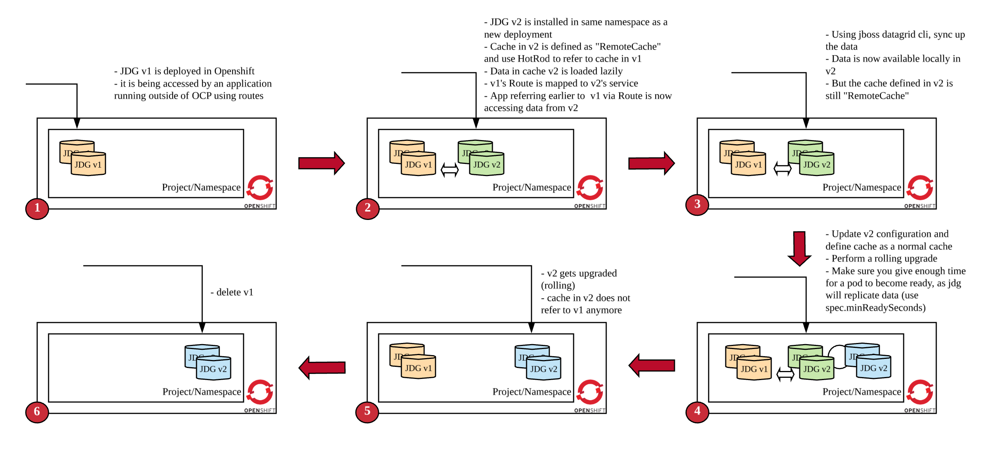
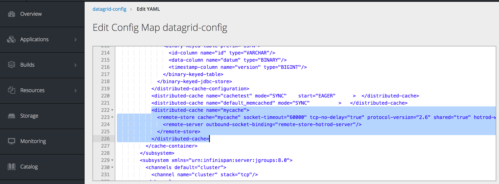
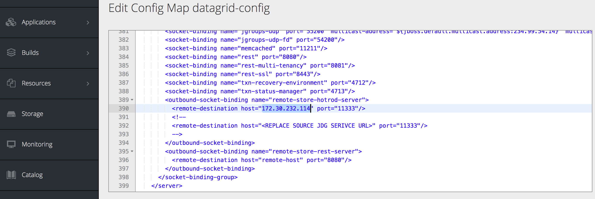
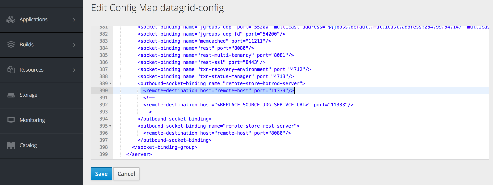

= Orchestrating JBoss Datagrid Upgrades in Openshift/Kubernetes

=== Introduction

This demo aims to provide starting point/code-sample to perform Datagrid upgrade in Openshift. Demo uses following versions of minishift and openshift

1. minishift v1.25.0+90fb23e
2. Openshift version v3.11.0

=== Challenges

JBoss Datagrid is a cache solution that stores data (as key-value) in memory. One of the requirement with in memory solution is to migrate data from one jdg version to new jdg version without losing in-memory data. And this becomes a bit tricky when datagrid is running on Openshift or kubernetes. 

=== Solution Architecture

Following image showcase how one could perform jdg upgrade from one version to another. 

1. Initially a jdg cluster is deployed on Openshift. Data could be acccessed via Openshift routes and service url.
2. A new version of jdg cluster is then deployed. Cache defined in Datagrid is "RemoteCache" that points to old jdg server via HotRod. Also routes and service selectors are updated to forward request (to upload or retrieve data) from new jdg. If new jdg does not find a key, it would lazily load data from old jdg.
3. Datagrid cli is used in one of the newly created pod to sync data between two clusters. 
4. In step 4, a rolling uprade of new jdg cluster is started. We update the cache to be a normal cache (instead of remotecache) in new pods. New pods joins the cluster and data is replicated.
5. In step 5, rolling upgrade is completed and now the cache in all new pods are in-place cache. 
6. Now the old jdg could be easily deleted.

=== Run Demo
==== Step 1: Install minishift
Run following command to start minishift
----
$ minishift start --memory 8GB
----

==== Step 2: Download JBoss Datagrid Imagestream
----
$ oc login -u system:admin
$ oc project openshift
$ oc import-image registry.access.redhat.com/jboss-datagrid-7/datagrid72-openshift:1.3 --confirm
----

create 1.2 and latest tag
----
$ oc tag registry.access.redhat.com/jboss-datagrid-7/datagrid72-openshift:1.2 datagrid72-openshift:1.2
$ # tag latest to 1.3
$ oc tag registry.access.redhat.com/jboss-datagrid-7/datagrid72-openshift:1.3 datagrid72-openshift:latest
$
$ oc describe is/datagrid72-openshift
----
last command should show you three tags

==== Step 2: Deploy datagrid v1

First upload template that would deploy datagrid 1.2 tag
----
$ oc project openshift
$ oc create -f templates/datagrid72-basic-1.2.json
$ oc new-project jdg
$ oc new-app --template=datagrid72-basic-12 --name=rhdg -e CACHE_NAMES=mycache -e MYCACHE_CACHE_START=EAGER
----

The above command would create a jdg instance with one cache - named mycache
Let's populate data in the cache
----
$ oc get pods -w
NAME                   READY     STATUS    RESTARTS   AGE
datagrid-app-1-542rg   1/1       Running   0          6d

make sure pod is running 

$ export JDG_URL=http://$(oc get route datagrid-app -o template --template='{{.spec.host}}')
$ curl -i -H "Accept:application/json" $JDG_URL/rest/mycache

HTTP/1.1 200 OK
cache-control: no-cache
content-type: application/json
content-length: 7
Set-Cookie: 50a0a48a8a3be7fd47e7a53f6905ba85=3bc0a32d6830c966ffb02ad29a56df54; path=/; HttpOnly

keys=[]

$ #The below script will populate 2000 keys in jdg
$ sh populatejdg.sh
----
Wait for the script to complete. And then check sample key
----
$ curl -i -H "Accept:application/json" $JDG_URL/rest/mycache/1234

HTTP/1.1 200 OK
etag: -273658358
last-modified: Thu, 1 Jan 1970 00:00:00 GMT
content-type: application/json
content-length: 18
Set-Cookie: 50a0a48a8a3be7fd47e7a53f6905ba85=3bc0a32d6830c966ffb02ad29a56df54; path=/; HttpOnly
Cache-control: private

"{\"Value 1234\"}"
----

==== Step 3: Deploy datagrid v2 and set up RemoteCache
Before deploying datagrid v2 version, we need to first define a remote cache. Open configuration/standalone.xml file and search for below

----
        <distributed-cache name="mycache">
          <remote-store cache="mycache" socket-timeout="60000" tcp-no-delay="true" protocol-version="2.6" shared="true" hotrod-wrapping="true" purge="false" passivation="false">
            <remote-server outbound-socket-binding="remote-store-hotrod-server"/>
          </remote-store>
        </distributed-cache>
----
Here we are defining a cache, mycache, which is a remotecache pointing to server defined by remote-store-hotrod-server. One thing to note here is the value for protocol-version. It should be pointing to source jdg. Please see the value here - https://access.redhat.com/documentation/en-us/red_hat_jboss_data_grid/7.2/html-single/administration_and_configuration_guide/#setting_up_the_target_cluster

Since our source and target are both on 7.2, the value is 2.6

Find out the service url of source jdg that we deployed in previous section

----
$ oc get svc/datagrid-app-hotrod
NAME                  TYPE        CLUSTER-IP       EXTERNAL-IP   PORT(S)     AGE
datagrid-app-hotrod   ClusterIP   172.30.232.114   <none>        11333/TCP   17m
----

Take the value (172.30.232.114) and replace in configuration/standalone.xml file. Search for "REPLACE SOURCE JDG SERIVCE URL" text and replace it with 172.30.232.114

----
Replace this

    <outbound-socket-binding name="remote-store-hotrod-server">
      <remote-destination host="<REPLACE SOURCE JDG SERIVCE URL>" port="11333"/>
    </outbound-socket-binding>

with 

    <outbound-socket-binding name="remote-store-hotrod-server">
      <remote-destination host="172.30.232.114" port="11333"/>
    </outbound-socket-binding>

----

Create a configmap

----
$ oc create configmap datagrid-config --from-file=./configuration/standalone.xml
----

We are now going to import a new template using which we would deploy new version of jdg. Open templates/datagrid72-extended.yaml file. Few things to note here -

1. We would need at least 2 replicas of the new cluster. We would do a rolling upgrade later on and we don't want to lose data then.
2. upgrade strategy is Rolling and not Recreate
3. spec.minReadySeconds is defined and assigned a value 60 (seconds). This is needed because when we do a rolling upgtade later, we want data to replicated to new jdg pod before an old pod is terminated
4. This template refers to 1.3 version of jdg

----
$ oc create -f templates/datagrid72-extended.yaml -n openshift
----

Deploy new jdg image now

----
$ oc new-app --template=datagrid72-extended
...
...
$ oc get pods -w
NAME                    READY     STATUS    RESTARTS   AGE
datagrid-app-1-542rg    1/1       Running   1          6d
datagrid-new-1-deploy   1/1       Running   0          1m
datagrid-new-1-jj7nm    1/1       Running   0          1m
datagrid-new-1-qqd8z    1/1       Running   0          1m
----

make sure "datagrid-new" pods are up and running
Fetch some data from the new jdg. It should refer to old jdg, retrieve the data and return.

----
$ export JDG_NEW_URL=http://$(oc get route datagrid-new -o template --template='{{.spec.host}}')
$ curl -i -H "Accept:application/json" $JDG_NEW_URL/rest/mycache/1

HTTP/1.1 200 OK
etag: 1207034047
last-modified: Thu, 1 Jan 1970 00:00:00 GMT
content-type: application/json
content-length: 15
Set-Cookie: 0b252f1a2910ff03ff01a2a50bb2bfe6=a7d44ba9a515db206c1477ad1ae19f91; path=/; HttpOnly
Cache-control: private

"{\"Value 1\"}"
----

Stop old jdg and retrieve value from new jdg. It should throw an error. 

----
$ oc scale dc datagrid-app --replicas=0
$ curl -i -H "Accept:application/json" $JDG_NEW_URL/rest/mycache/100
HTTP/1.1 500 Internal Server Error
content-length: 18
Set-Cookie: 0b252f1a2910ff03ff01a2a50bb2bfe6=9bf7ab5b0458fe0e2d5488c600274a51; path=/; HttpOnly

Connection refused
----

This is expected, because when key is not found in jdg new version, it tries to lazily load data from old version, however it is enable to contact the server. Let's start the old jdg and repopulate the data.

----
$ oc scale dc datagrid-app --replicas=1
$ # Run the next command only when pod is up and running
$ sh populatejdg.sh
$ # once completed, rerun the curl command again 
$ curl -i -H "Accept:application/json" $JDG_NEW_URL/rest/mycache/100

HTTP/1.1 200 OK
etag: -1344023297
last-modified: Thu, 1 Jan 1970 00:00:00 GMT
content-type: application/json
content-length: 17
Set-Cookie: 0b252f1a2910ff03ff01a2a50bb2bfe6=a7d44ba9a515db206c1477ad1ae19f91; path=/; HttpOnly
Cache-control: private

"{\"Value 100\"}"
----

==== Step 4: Migrate Data from old to new Datagrid

ssh into one of the new jdg pod 

----
$ oc get pods 
NAME                   READY     STATUS    RESTARTS   AGE
datagrid-app-1-mnbk2   1/1       Running   0          3m
datagrid-new-1-jj7nm   1/1       Running   0          12m
datagrid-new-1-qqd8z   1/1       Running   0          12m

$ # let's login to datagrid-new-1-jj7nm

$ oc rsh datagrid-new-1-jj7nm
sh-4.2$ /opt/datagrid/bin/cli.sh --connect controller=localhost:9990 -c "/subsystem=datagrid-infinispan/cache-container=clustered/distributed-cache=mycache:synchronize-data(migrator-name=hotrod)"
{"outcome" => "success"}

----

The above command has successfully replicated the data to new jdg.

==== Step 5: Rolling Upgrade and Move cache from RemoteCache to normal Cache

Give admin role to admin user first, so that you could see deployments in jdg project (you cannot login using system:admin user in web console.

1. Change mycache definition from

to 

image::images/cm-new-cache.png[NewCacheDef, 800, 480]

2. Change hot rod server from

to 

Once completed, roll out the new changes

----
$ oc rollout latest dc/datagrid-new
deploymentconfig.apps.openshift.io/datagrid-new rolled out

$ # See the status of new pods now. Run the following command below. you would notice that the new pod comes fast but then it waits for 60 seconds before one pod from old jdg is terminated. 
$ oc get pods -w
----

Once completed, you could now delete the old jdg. The new cache is not a remotecache anymore.

----
$ oc delete all -l app-rhdg
----

==== Step 6: Validate no data is lost

1. Validate that no data is lost. In case any key is missing, the below script will error out.

----
$ sh validatedata.sh
----

2. Validate that you could retrieve any non-existent key in new cache. In previous situation, the cache gave us an error because it didn't find the key and therefore looked at previous jdg to see if the key exists there.

----
$ curl -i -H "Accept:application/json" $JDG_NEW_URL/rest/mycache/3090
HTTP/1.1 404 Not Found
content-length: 0
Set-Cookie: 0b252f1a2910ff03ff01a2a50bb2bfe6=e4d1e657ce724f459649241962bf5da3; path=/; HttpOnly
----

